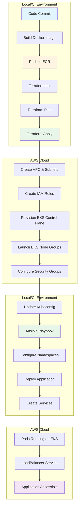
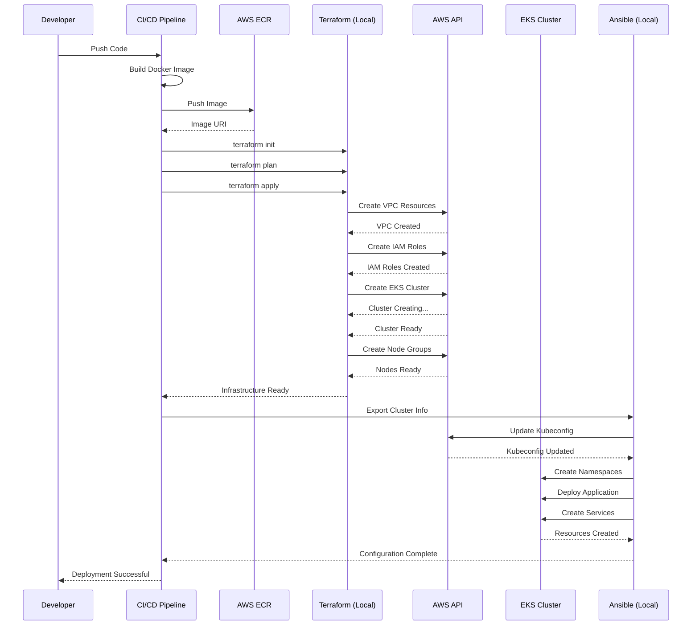
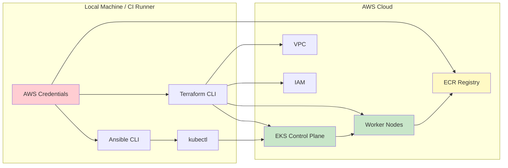

# CI/CD Pipeline: EKS Deployment with Terraform and Ansible

## Architecture Flow Diagram



## Detailed Pipeline Flow



## Component Interaction Diagram



---

## 1. Overview Flow

```
Developer Commit → Build Image → Push to ECR → Terraform (Provision EKS) → Ansible (Configure EKS) → Deploy Application
```

---

## 2. Terraform: Provision EKS Cluster

### Prerequisites
- AWS credentials configured locally (`~/.aws/credentials` or environment variables)
- Terraform installed
- IAM permissions for EKS, VPC, EC2, IAM roles

### Terraform Configuration Structure

```hcl
# main.tf
terraform {
  required_providers {
    aws = {
      source  = "hashicorp/aws"
      version = "~> 5.0"
    }
  }
  
  backend "s3" {
    bucket = "terraform-state-bucket"
    key    = "eks/terraform.tfstate"
    region = "us-east-1"
  }
}

provider "aws" {
  region = var.aws_region
}

module "vpc" {
  source = "terraform-aws-modules/vpc/aws"
  
  name = "eks-vpc"
  cidr = "10.0.0.0/16"
  
  azs             = ["us-east-1a", "us-east-1b", "us-east-1c"]
  private_subnets = ["10.0.1.0/24", "10.0.2.0/24", "10.0.3.0/24"]
  public_subnets  = ["10.0.101.0/24", "10.0.102.0/24", "10.0.103.0/24"]
  
  enable_nat_gateway   = true
  enable_dns_hostnames = true
  
  tags = {
    "kubernetes.io/cluster/${var.cluster_name}" = "shared"
  }
  
  public_subnet_tags = {
    "kubernetes.io/role/elb" = "1"
  }
  
  private_subnet_tags = {
    "kubernetes.io/role/internal-elb" = "1"
  }
}

module "eks" {
  source = "terraform-aws-modules/eks/aws"
  
  cluster_name    = var.cluster_name
  cluster_version = "1.28"
  
  vpc_id     = module.vpc.vpc_id
  subnet_ids = module.vpc.private_subnets
  
  cluster_endpoint_public_access = true
  
  eks_managed_node_groups = {
    main = {
      desired_size = 2
      min_size     = 1
      max_size     = 3
      
      instance_types = ["t3.medium"]
      capacity_type  = "ON_DEMAND"
      
      iam_role_additional_policies = {
        AmazonEC2ContainerRegistryReadOnly = "arn:aws:iam::aws:policy/AmazonEC2ContainerRegistryReadOnly"
      }
    }
  }
  
  tags = {
    Environment = "production"
    ManagedBy   = "terraform"
  }
}

# variables.tf
variable "aws_region" {
  description = "AWS region"
  default     = "us-east-1"
}

variable "cluster_name" {
  description = "EKS cluster name"
  default     = "my-eks-cluster"
}

# outputs.tf
output "cluster_endpoint" {
  description = "EKS cluster endpoint"
  value       = module.eks.cluster_endpoint
}

output "cluster_name" {
  description = "EKS cluster name"
  value       = module.eks.cluster_name
}

output "cluster_certificate_authority_data" {
  description = "Certificate authority data"
  value       = module.eks.cluster_certificate_authority_data
  sensitive   = true
}

output "cluster_region" {
  description = "AWS region"
  value       = var.aws_region
}
```

### Terraform Commands in CI/CD

```bash
# Initialize Terraform
terraform init

# Validate configuration
terraform validate

# Plan infrastructure changes
terraform plan -out=tfplan

# Apply infrastructure changes
terraform apply tfplan

# Export outputs for Ansible
terraform output -raw cluster_name > cluster_name.txt
terraform output -raw cluster_region > cluster_region.txt

# Update kubeconfig for local kubectl access
aws eks update-kubeconfig \
  --name $(terraform output -raw cluster_name) \
  --region $(terraform output -raw cluster_region)
```

---

## 3. Ansible: Configure EKS Cluster

### Prerequisites
- Ansible installed locally
- `kubernetes.core` collection: `ansible-galaxy collection install kubernetes.core`
- AWS CLI configured
- kubectl installed

### Ansible Inventory

```ini
# inventory/hosts.ini
[local]
localhost ansible_connection=local
```

### Ansible Playbook Structure

```yaml
# configure-eks.yml
---
- name: Configure EKS Cluster and Deploy Application
  hosts: localhost
  connection: local
  gather_facts: yes
  
  vars:
    cluster_name: "{{ lookup('env', 'EKS_CLUSTER_NAME') }}"
    aws_region: "{{ lookup('env', 'AWS_REGION') | default('us-east-1', true) }}"
    ecr_image: "{{ lookup('env', 'ECR_IMAGE_URI') }}"
    app_namespace: "production"
    app_name: "myapp"
  
  pre_tasks:
    - name: Verify required environment variables
      fail:
        msg: "Required environment variable {{ item }} is not set"
      when: lookup('env', item) == ''
      loop:
        - EKS_CLUSTER_NAME
        - ECR_IMAGE_URI
  
  tasks:
    - name: Update kubeconfig for EKS cluster
      command: >
        aws eks update-kubeconfig 
        --name {{ cluster_name }} 
        --region {{ aws_region }}
      changed_when: false
      
    - name: Wait for EKS cluster to be ready
      command: kubectl cluster-info
      register: cluster_info
      retries: 10
      delay: 30
      until: cluster_info.rc == 0
      changed_when: false
    
    - name: Create application namespace
      kubernetes.core.k8s:
        state: present
        definition:
          apiVersion: v1
          kind: Namespace
          metadata:
            name: "{{ app_namespace }}"
            labels:
              name: "{{ app_namespace }}"
    
    - name: Create ConfigMap for application
      kubernetes.core.k8s:
        state: present
        definition:
          apiVersion: v1
          kind: ConfigMap
          metadata:
            name: "{{ app_name }}-config"
            namespace: "{{ app_namespace }}"
          data:
            APP_ENV: "production"
            LOG_LEVEL: "info"
    
    - name: Deploy application
      kubernetes.core.k8s:
        state: present
        definition:
          apiVersion: apps/v1
          kind: Deployment
          metadata:
            name: "{{ app_name }}"
            namespace: "{{ app_namespace }}"
            labels:
              app: "{{ app_name }}"
          spec:
            replicas: 3
            selector:
              matchLabels:
                app: "{{ app_name }}"
            template:
              metadata:
                labels:
                  app: "{{ app_name }}"
              spec:
                containers:
                - name: "{{ app_name }}"
                  image: "{{ ecr_image }}"
                  ports:
                  - containerPort: 8080
                    name: http
                  envFrom:
                  - configMapRef:
                      name: "{{ app_name }}-config"
                  resources:
                    requests:
                      memory: "256Mi"
                      cpu: "250m"
                    limits:
                      memory: "512Mi"
                      cpu: "500m"
                  livenessProbe:
                    httpGet:
                      path: /health
                      port: 8080
                    initialDelaySeconds: 30
                    periodSeconds: 10
                  readinessProbe:
                    httpGet:
                      path: /ready
                      port: 8080
                    initialDelaySeconds: 5
                    periodSeconds: 5
    
    - name: Create LoadBalancer service
      kubernetes.core.k8s:
        state: present
        definition:
          apiVersion: v1
          kind: Service
          metadata:
            name: "{{ app_name }}-service"
            namespace: "{{ app_namespace }}"
            annotations:
              service.beta.kubernetes.io/aws-load-balancer-type: "nlb"
          spec:
            type: LoadBalancer
            selector:
              app: "{{ app_name }}"
            ports:
            - port: 80
              targetPort: 8080
              protocol: TCP
              name: http
    
    - name: Wait for deployment to be ready
      command: >
        kubectl rollout status deployment/{{ app_name }} 
        -n {{ app_namespace }} 
        --timeout=5m
      changed_when: false
    
    - name: Get LoadBalancer URL
      kubernetes.core.k8s_info:
        kind: Service
        name: "{{ app_name }}-service"
        namespace: "{{ app_namespace }}"
      register: service_info
      
    - name: Display application URL
      debug:
        msg: "Application URL: http://{{ service_info.resources[0].status.loadBalancer.ingress[0].hostname }}"
      when: service_info.resources[0].status.loadBalancer.ingress is defined
```

### Ansible Execution in CI/CD

```bash
# Install required Ansible collections
ansible-galaxy collection install kubernetes.core

# Set environment variables from Terraform outputs
export EKS_CLUSTER_NAME=$(terraform output -raw cluster_name)
export AWS_REGION=$(terraform output -raw cluster_region)
export ECR_IMAGE_URI="123456789012.dkr.ecr.us-east-1.amazonaws.com/myapp:latest"

# Run Ansible playbook
ansible-playbook configure-eks.yml -i inventory/hosts.ini

# Or with verbose output
ansible-playbook configure-eks.yml -i inventory/hosts.ini -vv
```

---

## 4. Complete CI/CD Pipeline Examples

### GitHub Actions

```yaml
# .github/workflows/deploy.yml
name: Deploy to EKS

on:
  push:
    branches: [main]

env:
  AWS_REGION: us-east-1
  ECR_REGISTRY: 123456789012.dkr.ecr.us-east-1.amazonaws.com
  ECR_REPOSITORY: myapp
  CLUSTER_NAME: my-eks-cluster

jobs:
  deploy:
    runs-on: ubuntu-latest
    
    steps:
    - name: Checkout code
      uses: actions/checkout@v3
    
    - name: Configure AWS credentials
      uses: aws-actions/configure-aws-credentials@v2
      with:
        aws-access-key-id: ${{ secrets.AWS_ACCESS_KEY_ID }}
        aws-secret-access-key: ${{ secrets.AWS_SECRET_ACCESS_KEY }}
        aws-region: ${{ env.AWS_REGION }}
    
    - name: Login to Amazon ECR
      id: login-ecr
      run: |
        aws ecr get-login-password --region ${{ env.AWS_REGION }} | \
        docker login --username AWS --password-stdin ${{ env.ECR_REGISTRY }}
    
    - name: Build and push Docker image
      id: build-image
      run: |
        IMAGE_TAG=${{ github.sha }}
        docker build -t ${{ env.ECR_REPOSITORY }}:$IMAGE_TAG .
        docker tag ${{ env.ECR_REPOSITORY }}:$IMAGE_TAG \
          ${{ env.ECR_REGISTRY }}/${{ env.ECR_REPOSITORY }}:$IMAGE_TAG
        docker push ${{ env.ECR_REGISTRY }}/${{ env.ECR_REPOSITORY }}:$IMAGE_TAG
        echo "image=${{ env.ECR_REGISTRY }}/${{ env.ECR_REPOSITORY }}:$IMAGE_TAG" >> $GITHUB_OUTPUT
    
    - name: Setup Terraform
      uses: hashicorp/setup-terraform@v2
      with:
        terraform_version: 1.5.0
    
    - name: Terraform Init
      working-directory: ./terraform
      run: terraform init
    
    - name: Terraform Plan
      working-directory: ./terraform
      run: terraform plan -out=tfplan
    
    - name: Terraform Apply
      working-directory: ./terraform
      run: terraform apply -auto-approve tfplan
    
    - name: Export Terraform Outputs
      working-directory: ./terraform
      run: |
        echo "EKS_CLUSTER_NAME=$(terraform output -raw cluster_name)" >> $GITHUB_ENV
        echo "AWS_REGION=$(terraform output -raw cluster_region)" >> $GITHUB_ENV
    
    - name: Setup Python
      uses: actions/setup-python@v4
      with:
        python-version: '3.10'
    
    - name: Install Ansible and dependencies
      run: |
        pip install ansible kubernetes boto3
        ansible-galaxy collection install kubernetes.core
    
    - name: Configure EKS with Ansible
      env:
        ECR_IMAGE_URI: ${{ steps.build-image.outputs.image }}
      run: |
        ansible-playbook ansible/configure-eks.yml
    
    - name: Deployment Summary
      run: |
        echo "🚀 Deployment Complete!"
        echo "Cluster: ${{ env.EKS_CLUSTER_NAME }}"
        echo "Image: ${{ steps.build-image.outputs.image }}"
```

### GitLab CI

```yaml
# .gitlab-ci.yml
stages:
  - build
  - provision
  - configure
  - deploy

variables:
  AWS_REGION: us-east-1
  ECR_REGISTRY: 123456789012.dkr.ecr.us-east-1.amazonaws.com
  ECR_REPOSITORY: myapp
  CLUSTER_NAME: my-eks-cluster

build:
  stage: build
  image: docker:latest
  services:
    - docker:dind
  script:
    - apk add --no-cache python3 py3-pip aws-cli
    - aws ecr get-login-password --region $AWS_REGION | docker login --username AWS --password-stdin $ECR_REGISTRY
    - IMAGE_TAG=$CI_COMMIT_SHA
    - docker build -t $ECR_REPOSITORY:$IMAGE_TAG .
    - docker tag $ECR_REPOSITORY:$IMAGE_TAG $ECR_REGISTRY/$ECR_REPOSITORY:$IMAGE_TAG
    - docker push $ECR_REGISTRY/$ECR_REPOSITORY:$IMAGE_TAG
    - echo "ECR_IMAGE_URI=$ECR_REGISTRY/$ECR_REPOSITORY:$IMAGE_TAG" >> build.env
  artifacts:
    reports:
      dotenv: build.env

provision:
  stage: provision
  image: hashicorp/terraform:1.5.0
  before_script:
    - cd terraform
  script:
    - terraform init
    - terraform plan -out=tfplan
    - terraform apply -auto-approve tfplan
    - terraform output -raw cluster_name > ../cluster_name.txt
    - terraform output -raw cluster_region > ../cluster_region.txt
  artifacts:
    paths:
      - cluster_name.txt
      - cluster_region.txt

configure:
  stage: configure
  image: python:3.10
  dependencies:
    - build
    - provision
  before_script:
    - pip install ansible kubernetes boto3 awscli
    - ansible-galaxy collection install kubernetes.core
  script:
    - export EKS_CLUSTER_NAME=$(cat cluster_name.txt)
    - export AWS_REGION=$(cat cluster_region.txt)
    - ansible-playbook ansible/configure-eks.yml
```

### Jenkins Pipeline

```groovy
// Jenkinsfile
pipeline {
    agent any
    
    environment {
        AWS_REGION = 'us-east-1'
        ECR_REGISTRY = '123456789012.dkr.ecr.us-east-1.amazonaws.com'
        ECR_REPOSITORY = 'myapp'
        CLUSTER_NAME = 'my-eks-cluster'
    }
    
    stages {
        stage('Build and Push to ECR') {
            steps {
                script {
                    sh '''
                        aws ecr get-login-password --region ${AWS_REGION} | \
                        docker login --username AWS --password-stdin ${ECR_REGISTRY}
                        
                        IMAGE_TAG=${GIT_COMMIT}
                        docker build -t ${ECR_REPOSITORY}:${IMAGE_TAG} .
                        docker tag ${ECR_REPOSITORY}:${IMAGE_TAG} \
                          ${ECR_REGISTRY}/${ECR_REPOSITORY}:${IMAGE_TAG}
                        docker push ${ECR_REGISTRY}/${ECR_REPOSITORY}:${IMAGE_TAG}
                        
                        echo "${ECR_REGISTRY}/${ECR_REPOSITORY}:${IMAGE_TAG}" > ecr_image.txt
                    '''
                }
            }
        }
        
        stage('Provision with Terraform') {
            steps {
                dir('terraform') {
                    sh '''
                        terraform init
                        terraform plan -out=tfplan
                        terraform apply -auto-approve tfplan
                        terraform output -raw cluster_name > ../cluster_name.txt
                        terraform output -raw cluster_region > ../cluster_region.txt
                    '''
                }
            }
        }
        
        stage('Configure with Ansible') {
            steps {
                script {
                    sh '''
                        pip install ansible kubernetes boto3
                        ansible-galaxy collection install kubernetes.core
                        
                        export EKS_CLUSTER_NAME=$(cat cluster_name.txt)
                        export AWS_REGION=$(cat cluster_region.txt)
                        export ECR_IMAGE_URI=$(cat ecr_image.txt)
                        
                        ansible-playbook ansible/configure-eks.yml
                    '''
                }
            }
        }
    }
    
    post {
        success {
            echo 'Deployment successful!'
        }
        failure {
            echo 'Deployment failed!'
        }
    }
}
```

---

## 5. Project Structure

```
project-root/
├── .github/
│   └── workflows/
│       └── deploy.yml
├── terraform/
│   ├── main.tf
│   ├── variables.tf
│   ├── outputs.tf
│   └── backend.tf
├── ansible/
│   ├── configure-eks.yml
│   ├── inventory/
│   │   └── hosts.ini
│   └── roles/
│       └── eks-config/
│           ├── tasks/
│           │   └── main.yml
│           └── templates/
├── Dockerfile
├── README.md
└── .gitignore
```

---

## 6. Key Points and Best Practices

### Authentication & Security
1. **AWS Credentials**: Configure via `aws configure` or environment variables (`AWS_ACCESS_KEY_ID`, `AWS_SECRET_ACCESS_KEY`)
2. **IAM Permissions**: Ensure proper permissions for EKS, VPC, EC2, IAM, ECR
3. **Secrets Management**: Never hardcode secrets; use AWS Secrets Manager or Parameter Store
4. **RBAC**: Implement Kubernetes RBAC for cluster access control

### State Management
1. **Terraform Remote Backend**: Use S3 bucket with DynamoDB for state locking
2. **State Versioning**: Enable versioning on S3 bucket
3. **Workspace Isolation**: Use Terraform workspaces for different environments

### Configuration Flow
```
Terraform Provisions → Outputs Cluster Info → AWS CLI Updates Kubeconfig → Ansible Uses Kubeconfig → Deploy to EKS
```

### ECR Access
1. **Node IAM Role**: Terraform automatically creates IAM role with ECR read permissions
2. **Image Pull Policy**: Use `IfNotPresent` or `Always` based on requirements
3. **Private Registry**: EKS nodes authenticate to ECR automatically via IAM

### Monitoring & Validation
1. **Terraform Validation**: Run `terraform validate` before apply
2. **Ansible Dry Run**: Use `--check` flag for validation
3. **Health Checks**: Implement liveness and readiness probes
4. **Logging**: Enable CloudWatch Container Insights for EKS

### Idempotency
- Both Terraform and Ansible are idempotent
- Safe to re-run without causing duplicate resources
- Use `terraform plan` to preview changes

### Cleanup
```bash
# Ansible cleanup (delete deployments)
kubectl delete namespace production

# Terraform cleanup (destroy infrastructure)
terraform destroy -auto-approve
```

---

## 7. Troubleshooting

### Common Issues

**Issue**: Terraform can't authenticate to AWS
```bash
# Solution: Configure AWS credentials
aws configure
# Or set environment variables
export AWS_ACCESS_KEY_ID="your-key"
export AWS_SECRET_ACCESS_KEY="your-secret"
```

**Issue**: Ansible can't connect to EKS cluster
```bash
# Solution: Update kubeconfig
aws eks update-kubeconfig --name my-eks-cluster --region us-east-1

# Verify connection
kubectl cluster-info
```

**Issue**: Pods can't pull images from ECR
```bash
# Solution: Verify node IAM role has ECR permissions
aws eks describe-nodegroup --cluster-name my-eks-cluster \
  --nodegroup-name main --query 'nodegroup.nodeRole'

# Check IAM role policies
aws iam list-attached-role-policies --role-name <node-role-name>
```

**Issue**: LoadBalancer service stuck in pending
```bash
# Solution: Check AWS Load Balancer Controller
kubectl logs -n kube-system deployment/aws-load-balancer-controller

# Install if missing
helm repo add eks https://aws.github.io/eks-charts
helm install aws-load-balancer-controller eks/aws-load-balancer-controller \
  -n kube-system --set clusterName=my-eks-cluster
```

---

## 8. Additional Resources

- [Terraform AWS EKS Module](https://registry.terraform.io/modules/terraform-aws-modules/eks/aws/latest)
- [Ansible Kubernetes Collection](https://docs.ansible.com/ansible/latest/collections/kubernetes/core/index.html)
- [AWS EKS Best Practices](https://aws.github.io/aws-eks-best-practices/)
- [EKS Workshop](https://www.eksworkshop.com/)
